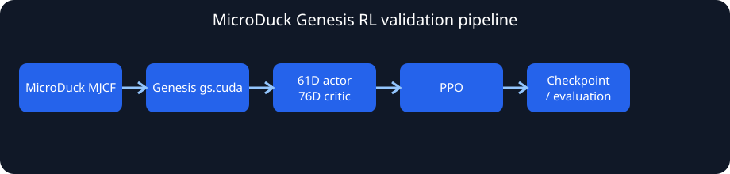
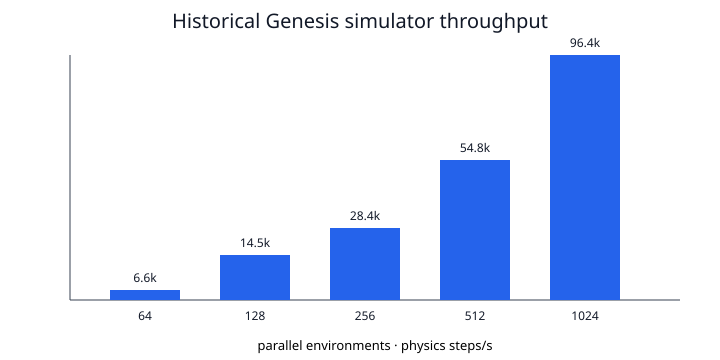

# MicroDuck Genesis

Genesis implementation work for the current upstream
`Mjlab-Velocity-Flat-MicroDuck` task. The actor ABI is 61D, the privileged
critic ABI is 76D, and the policy has 14 joint-position actions. Review the
[upstream audit](docs/microduck_rl_audit.md), [observation parity](docs/observation_parity.md),
and [parity scorecard](docs/parity_scorecard.md) before using a checkpoint.



The repository includes measured benchmark data and a visual summary. These
are simulator throughput measurements, not evidence that a policy walks:



Raw values are in [`docs/benchmark_data.csv`](docs/benchmark_data.csv) and
[`logs/genesis_benchmark.csv`](logs/genesis_benchmark.csv). No locomotion GIF
or video is included because visual policy behavior has not yet been validated.

Install using the existing project environment:

```bash
cd /home/batman/microduck_genesis
source .venv/bin/activate
```

The Genesis environment is CUDA-enabled on the validated RTX 4050 setup. Check
the driver, PyTorch, and Genesis backend before running RL:

```bash
python scripts/check_system.py
python -c "import torch; print(torch.cuda.is_available(), torch.version.cuda)"
```

For exact upstream configuration inspection, create the separate locked MJLab
environment. This does not modify `.venv`:

```bash
uv venv --python 3.12 .venv-mjlab
UV_PROJECT_ENVIRONMENT="$PWD/.venv-mjlab" uv sync --project upstream/microduck_rl --locked
```

Genesis and model checks:

```bash
python scripts/check_system.py
python scripts/test_genesis.py
PYTHONPATH=src python scripts/inspect_observations.py
PYTHONPATH=src python scripts/run_microduck.py --headless
```

The observation layout is explicitly checked at runtime. The actor fields are
base angular velocity, projected gravity, relative joint position and velocity,
last action, twist command, head-pose command, and body-pose command. There is
no frame stacking, LSTM, GRU, or recurrent state.

Run a one-environment RL reward smoke check, then increase only after it is
stable:

```bash
PYTHONPATH=src python scripts/test_rewards.py --num-envs 1 --device cpu
PYTHONPATH=src python scripts/test_rewards.py --num-envs 8 --device cuda
PYTHONPATH=src python scripts/test_rewards.py --num-envs 64 --device cuda
```

Check the Genesis contact path and the upstream BAM actuator equations:

```bash
PYTHONPATH=src python scripts/test_contacts.py --device cuda
PYTHONPATH=src .venv-mjlab/bin/python scripts/test_bam.py
```

`test_bam.py` writes `logs/bam_parity.csv`. The BAM motor equations match the
upstream implementation numerically; Genesis still approximates MuJoCo's
native static-friction constraint. See [the BAM model](docs/bam_model.md) and
[reward parity](docs/reward_parity.md).

Start a deliberately short PPO pipeline check:

```bash
PYTHONPATH=src python scripts/train.py --num-envs 64 --headless --device cuda --iterations 5
```

The PPO runner keeps the 61D actor and 76D privileged critic streams separate.
Use a fixed command and disable randomization for an easy debugging run:

```bash
PYTHONPATH=src python scripts/train.py \
  --num-envs 64 --headless --device cuda --iterations 50 \
  --evaluation-command forward --no-randomization
```

This is a validation experiment, not a full locomotion run. Do not launch a
long training job until the remaining parity items have been reviewed.

Resume or evaluate a local checkpoint:

```bash
PYTHONPATH=src python scripts/train.py --num-envs 256 --headless --device cuda --iterations 100 --checkpoint checkpoints/model_0004.pt --resume
PYTHONPATH=src python scripts/evaluate.py --checkpoint checkpoints/model_0004.pt --viewer --device cuda
```

If an actual exported upstream 61D/14D feed-forward ONNX policy is made
available locally, test it without retraining or silently changing its ABI:

```bash
PYTHONPATH=src python scripts/eval_mujoco_policy_in_genesis.py --onnx /path/to/policy.onnx --device cuda
```

For fresh RL capacity checks, run:

```bash
PYTHONPATH=src python scripts/benchmark_rl.py --num-envs 256 --device cuda
PYTHONPATH=src python scripts/benchmark_rl.py --num-envs 512 --device cuda
PYTHONPATH=src python scripts/benchmark_rl.py --num-envs 1024 --device cuda
```

For simulator-only capacity checks, run `PYTHONPATH=src python scripts/benchmark_genesis.py`.
The target RTX 4050 has 6 GB VRAM: begin training at 256 environments, then
test 512 before considering 1024. Do not use measured simulator-only capacity
as the training count; leave VRAM for PPO.

Troubleshooting: under WSL, run the helper scripts normally; they re-exec with
`/usr/lib/wsl/lib` when needed. If `torch.cuda.is_available()` is false, use
the CPU smoke path only. Do not treat CPU validation as an RTX throughput or
memory result.

The completed GPU measurements and limitations are recorded in
`docs/rl_validation.md`. Current measured RL simulation throughput is about
16.7k, 38.3k, and 81.7k physics steps/s at 256, 512, and 1024 environments;
PPO throughput is memory-safe at those counts, but 256 remains the recommended
starting point. The project is currently **NOT READY FOR LOCOMOTION TRAINING**:
paired MuJoCo/Genesis trajectories, exact terrain raycasts, upstream sensor
noise/delay, and complete model-field randomization still need validation.
